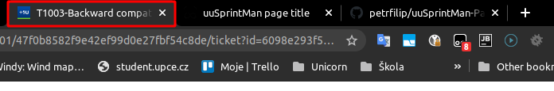

# uuSprintMan-PageTitle

Get value of H1 element and put it to the web page title. 

## Install as a User Script - Tampermonkey

Install as a User Script - Tampermonkey

Add https://tampermonkey.net/ into your browser

Install User script from this URL: index.js
